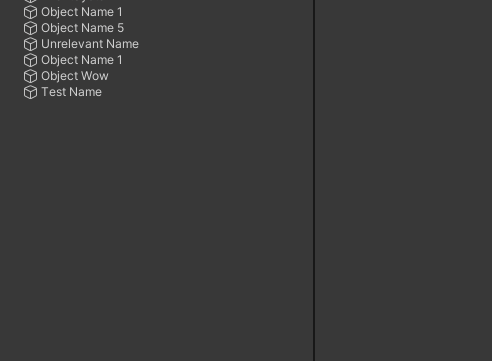

# Regex Rename
Select multiple scene objects or assets, and press `F2` to open the new regex rename window.

## Installation
- OpenUPM
  - `openupm add com.nomnom.regex-rename`
- Package Manager
  - Add through git url `https://github.com/nomnomab/Regex-Rename.git`